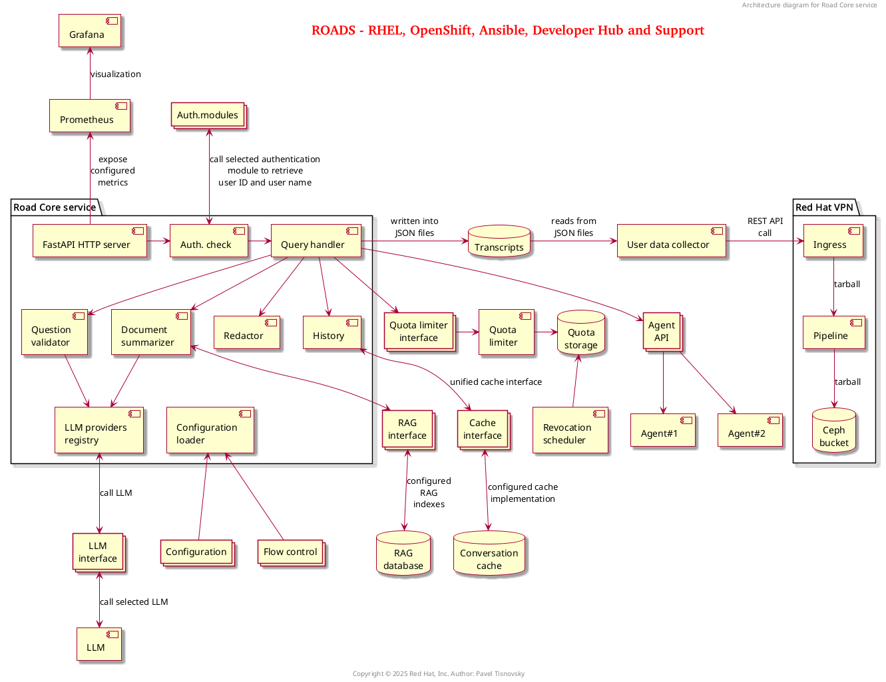

# Road Core service

## Description

Road Core Service (RCS) is an AI powered assistant that can run in any environment (including OpenShift)
and provides answers to product questions using backend LLM services. Currently
[OpenAI](https://openai.com/), [Azure
OpenAI](https://azure.microsoft.com/en-us/products/ai-services/openai-service),
[OpenShift
AI](https://www.redhat.com/en/technologies/cloud-computing/openshift/openshift-ai),
[RHEL
AI](https://www.redhat.com/en/technologies/linux-platforms/enterprise-linux/ai),
and [Watsonx](https://www.ibm.com/watsonx) are officially supported as
backends. Other providers, even ones that are not fully supported, can be used
as well. For example, it is possible to use BAM (IBM's research environment).
It is also possible to run [InstructLab](https://instructlab.ai/) locally,
configure model, and connect to it.

## Architecture

## Quick howto

## Developer info

1. [Service configuration class hierarchy](service_configuration_classes.md)
