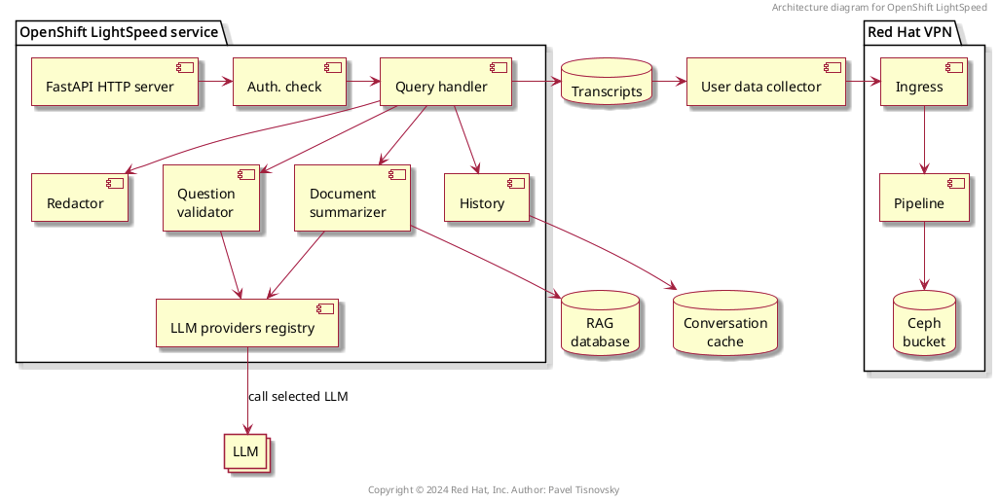

## Road Core Service: presentation

---

## Introduction

- an AI powered assistant
- provides answers to product questions using backend LLM services
- can be run locally, in containerized environment, on OpenShift
- has it's own UI
- is accessible via REST API

---

## Supported LLM providers

- OpenAI
- Azure OpenAI
- OpenShift AI (RHOA)
- RHEL AI (RHELAI)
- WatsonX
- BAM (IBM's research environment)
- local or remote Ollama
- (plugin system to add more providers)

---

## Supported RAG storages

- FAISS
- PGVector
- (plugin system to add more RAG storages)

---

## Other features

- token truncation algorithm
- quota limiter (configurable)
- storage for conversation history
- user feedback + conversation can be send to selected telemetry storage
- exposed Prometheus metrics
- configurable authentication and authorization

---

## Architecture

- Road Core Service components

---



---

## Integration

- an example how the service is integrated into OpenShift ecosystem

---


---

## Sequence diagrams

1. user question processing
1. user data flow when telemetry is enabled

---


---


---

## Installation

- on Linux
- on MacOS

---

### Linux

Prerequisites:

1. Python 3.10, 3.11, or 3.12
1. `pip` installed

---

### Linux

Installation steps:

1. `git clone https://github.com/road-core/service`
1. `pip install --user pdm`
1. `pdm --version`
1. `pdm install`

---

### MacOS

Prerequisites:

1. Python 3.10, 3.11, or 3.12
1. `brew`
1. `git`

---

### MacOS

Installation:

1. `brew install pdm`
1. `pdm --version` -- should return no error
1. `git clone https://github.com/road-core/service`
1. `cd service`
1. `pdm info` -- should return no error
1. change `torch==2.6.0+cpu` to `torch==2.6.0` in `pyproject.toml` (section `[project]/dependencies`)
1. `pdm install`

---

### MacOS

Installation failure:

if it fails (for example because you ran `pdm install` before changing `pyproject.toml`) run:

```sh
pdm update
pdm install
```

---

### Configuration

1. Retrieve OpenAI key
1. Store into file `openai_api_key.txt`
1. Modify configuration file `rcsconfig.yaml`

---

### Minimal service configuration

```
llm_providers:
  - name: my_openai
    type: openai
    url: "https://api.openai.com/v1"
    credentials_path: openai_api_key.txt
    models:
      - name: gpt-3.5-turbo
ols_config:
  conversation_cache:
    type: memory
    memory:
      max_entries: 1000
  default_provider: my_openai
  default_model: gpt-3.5-turbo
  authentication_config:
    module: "noop"

dev_config:
  # config options specific to dev environment
  # - launching OLS in local
  enable_dev_ui: true
  disable_auth: true
  disable_tls: true
```

---

### Running

Run the service by following command:

```sh
pdm run start
```

Open following pages in web browser:

1. [localhost:8080/ui](localhost:8080/ui)
1. [localhost:8080/docs](localhost:8080/docs)

Hit Ctrl-C to stop.

---

### RAG

* Retrieval-augmented generation

Stop the service before making these changes!

Build the RAG:

```sh
make get-rag
```

---

### RAG configuration

Configuration in `rcsconfig.yaml` with RAG:

```yaml
llm_providers:
  - name: my_openai
    type: openai
    url: "https://api.openai.com/v1"
    credentials_path: openai_api_key.txt
    models:
      - name: gpt-3.5-turbo
ols_config:
  conversation_cache:
    type: memory
    memory:
      max_entries: 1000
  default_provider: my_openai
  default_model: gpt-3.5-turbo
  authentication_config:
    module: "noop"
  reference_content:
    product_docs_index_path: "./vector_db/ocp_product_docs/4.15"
    product_docs_index_id: ocp-product-docs-4_15
    embeddings_model_path: "./embeddings_model"

dev_config:
  enable_dev_ui: true
  disable_auth: true
  disable_tls: true
```

---

## Service configuration

- different provider
- multiple LLM providers
- PGVector for RAG
- Postgres for conversation history
- Quota limiter configuration
- TLS settings for LLM providers
- Auth. config

---

### Ollama provider

```yaml
llm_providers:
  - name: ollama
    type: openai
    url: "http://localhost:11434/v1/"
    models:
      - name: 'llama3.2'
```

---

### Multiple LLM providers

```yaml
llm_providers:
  - name: my_openai
    type: openai
    url: "https://api.openai.com/v1"
    credentials_path: openai_api_key.txt
    models:
      - name: gpt-3.5-turbo
  - name: ollama
    type: openai
    url: "http://localhost:11434/v1/"
    models:
      - name: 'llama3.2'
```

---

### PGVector for RAG

```yaml
ols_config:
  reference_content:
    vector_store_type: postgres
    product_docs_index_id: product_index
    embeddings_model_path: "./embeddings_model"
    postgres:
      host: localhost
      port: 15432
      dbname: postgres
      user: postgres
      password_path: /var/tmp/secrets/postgres.txt
```

---

### Postgres for conversation history

```yaml
ols_config:
  conversation_cache:
    type: postgres
    postgres:
      host: "foobar.com"
      port: "1234"
      dbname: "test"
      user: "user"
      password_path: tests/config/postgres_password.txt
      ca_cert_path: tests/config/postgres_cert.crt
      ssl_mode: "require"
```

---

### Quota limiter configuration

```yaml
ols_config:
  quota_handlers:
    storage:
      host: ""
      port: "5432"
      dbname: "test"
      user: "tester"
      password_path: postgres_password.txt
      ssl_mode: "disable"
    limiters:
      - name: user_monthly_limits
        type: user_limiter
        initial_quota: 1000000
        quota_increase: 1000
        period: "30 days"
      - name: cluster_monthly_limits
        type: cluster_limiter
        initial_quota: 0
        quota_increase: 1000
        period: "30 days"
    scheduler:
      # scheduler ticks in seconds
      period: 300
```

---

### TLS settings for LLM providers

```yaml
llm_providers:
  - name: my_bam
    type: bam
    url: "https://bam-api.res.ibm.com"
    credentials_path: bam_api_key.txt
    models:
      - name: ibm/granite-3-8b-instruct
        context_window_size: 8000
        parameters:
          max_tokens_for_response: 500
    tlsSecurityProfile:
      type: Custom
      ciphers:
          - TLS_ECDHE_RSA_WITH_AES_128_GCM_SHA256
          - TLS_ECDHE_RSA_WITH_AES_256_GCM_SHA384
      minTLSVersion: VersionTLS13
```

---

### Auth config

```yaml
ols_config:
  authentication_config:
    module: "k8s"
    k8s_cluster_api: "https://api.example.com:6443"
    k8s_ca_cert_path: "/Users/home/ca.crt"
    skip_tls_verification: false
```
